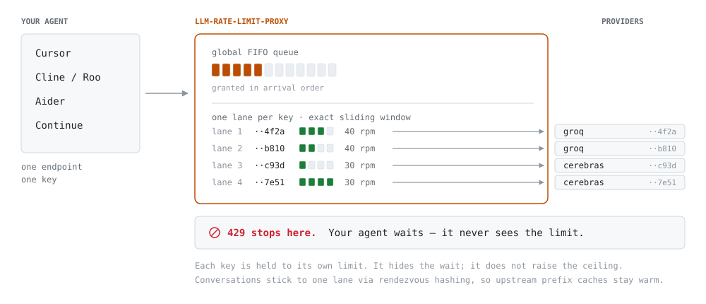
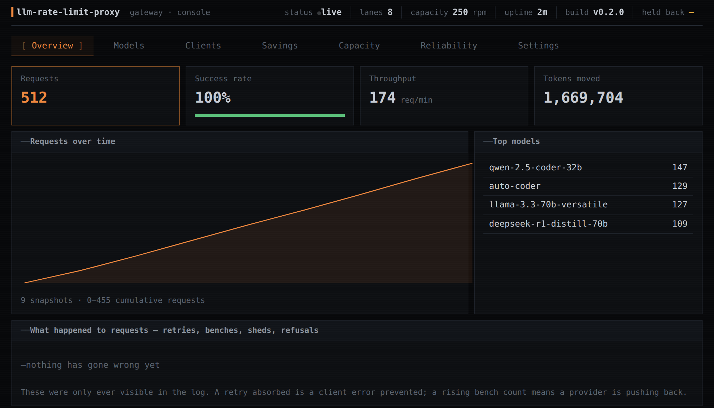

# LLM Rate Limit Proxy

**Your coding agent never sees a rate limit again.**

Point Cline, Aider or any OpenAI-compatible harness at one endpoint with one key.
It pools every API key you own across every provider you use, paces each request
inside that key's real limit, and fails over when a key or a provider misbehaves
— so the 429 that used to kill your agent mid-task never reaches it.

Rust · single 4 MB binary · self-hosted · your keys never leave your machine.

[](https://github.com/0xSteph/llm-rate-limit-proxy/actions/workflows/ci.yml)
[](https://github.com/0xSteph/llm-rate-limit-proxy/releases)
[](#license)


Same agent. Same key. Same provider, same rate limit. The only difference is
what sits in the middle.

## The problem

Free and low-tier LLM APIs cap requests per minute, per key. Your agent burns
through that cap in one refactor, the provider returns `429`, and the harness
aborts — usually halfway through a multi-file edit, usually without saving its
work.

The usual workarounds are all bad. Wait and retry by hand. Juggle three accounts
and paste a different key each time. Pay for a tier you need for ten minutes a
day.

## Quickstart

```sh
curl -fsSL https://raw.githubusercontent.com/0xSteph/llm-rate-limit-proxy/master/install.sh | sh
```

Downloads the right binary, verifies its checksum, installs a hardened systemd
service, and starts it. Open `http://localhost:8000`, and the wizard walks you
through an admin account, your first provider key, and mints your client key.

Then point your harness at it:

| Harness | Setting |
|---|---|
| **Cline / Roo Code** | Provider: *OpenAI Compatible* · Base URL `http://localhost:8000/v1` |
| **Aider** | `aider --openai-api-base http://localhost:8000/v1 --openai-api-key lrlp_...` |
| **Continue** | `"apiBase": "http://localhost:8000/v1"` on an `openai` provider |
| **Cursor** | Settings → Models → Override OpenAI Base URL. Works for API-key models; it can't help with Cursor's own subscription models, which are rate limited by Cursor, not by a key you hold |
| **Anything else** | Any client that takes an OpenAI-compatible base URL |

```sh
export OPENAI_BASE_URL=http://localhost:8000/v1
export OPENAI_API_KEY=lrlp_your_client_key
```

Re-run the installer to upgrade; your keys and settings are untouched.

> This proxy speaks the **OpenAI-compatible** API (`/v1/chat/completions`, `Bearer`
> auth). Claude Code and other Anthropic-protocol clients are not supported yet —
> see [Roadmap](#roadmap).

## How it works

<picture>
  <source media="(prefers-color-scheme: dark)" srcset="docs/architecture-dark.svg">
  
</picture>

**It makes your agent patient rather than making your limits bigger.** Requests
queue instead of failing, and streaming clients are held open with SSE heartbeats
while they wait.

**Every key gets its own lane.** Each lane has an exact sliding-window limiter
plus a jitter margin, so a boundary-timed request can't land inside the
provider's window. A single global FIFO queue feeds them, granting slots in
arrival order so no client can starve another.

**Conversations stick to one key** via rendezvous hashing, keeping any upstream
prefix cache warm. Adding or removing a key relocates only that key's share of
conversations rather than remapping all of them.

**A rebuffed key gets benched** for as long as its `Retry-After` asks, so the
next request doesn't rediscover the same wall — it goes to another key, or
another provider entirely.

To be explicit about what this is not: it does not raise anyone's rate limit and
is not a way around anyone's terms of service. Each key is held to its own
limit, slightly under it in fact. Throughput is unchanged. What changes is that
the limit stops being *your* problem and becomes the proxy's.

<details>
<summary><b>Everything else it does</b></summary>

**Routing**

- Everything without conversation affinity takes the least-loaded lane,
  spreading concurrent work across keys instead of stacking it on the first one

**Resilience**

- Automatic failover across keys and across providers
- A model-pressure governor for provider-side concurrency caps that key failover
  cannot relieve. Detection is behavioral — the same model rebuffed on two
  different keys within seconds — so it needs no knowledge of any provider's
  error wording
- Optional absolute request deadlines via `X-Llm-Rate-Limit-Proxy-Deadline-Ms`
- Bounded concurrency with load shedding

**Multi-provider**

- Several upstream providers behind one endpoint
- Virtual models: a name that resolves to an ordered list of concrete targets,
  tried in turn, so a request survives a provider outage
- `/v1/models` merges every provider's catalog with your virtual models and is
  served from cache, so catalog polls cost no rate budget

**Operations**

- Setup wizard, session auth, client API keys stored only as digests
- Runtime settings, all live with no restart: providers, provider keys, client
  keys, virtual models, operator accounts, and limits
- Content-blind metrics (counts, sizes, latencies — never message content),
  persisted snapshots for range views, and a dashboard
- `/api/pressure` reports models held back by provider-side limits, so a stalled
  agent is never mistaken for an idle proxy

</details>

## The console



Content-blind by construction — counts, sizes and latencies, never message
content. `/metrics` serves the same numbers as Prometheus text.

## Why not just use LiteLLM?

Different jobs. LiteLLM is a broad translation layer across 100+ providers with
budgets, teams, and a Python stack behind it. If you need that, use it.

This is one thing done narrowly: keeping a *coding agent* alive against per-key
rate limits.

| | llm-rate-limit-proxy | LiteLLM Proxy |
|---|---|---|
| Runtime | One 4 MB static binary | Python + dependency tree |
| Providers | Any OpenAI-compatible endpoint | 100+, with protocol translation |
| On hitting a limit | Queues and paces; client never sees `429` | Retries and fallbacks |
| Streaming under queue | Held open with SSE heartbeats | Client waits on the request |
| Rate-limit correctness | Load test asserts **zero** upstream violations at 100 concurrent clients | — |
| Scope | Deliberately small | Deliberately broad |

## Other ways to install

**Container:**

```sh
docker run -d --name llm-rate-limit-proxy \
  -p 127.0.0.1:8000:8000 \
  -v llm-rate-limit-proxy-data:/data \
  ghcr.io/0xsteph/llm-rate-limit-proxy:latest
```

Or with compose, which also applies the hardening (read-only root, no
capabilities, loopback publish):

```sh
docker compose up -d
```

**Binary** — attached to each release for `linux/amd64` and `linux/arm64`:

```sh
curl -fsSLO https://github.com/0xSteph/llm-rate-limit-proxy/releases/latest/download/SHA256SUMS
curl -fsSLO https://github.com/0xSteph/llm-rate-limit-proxy/releases/latest/download/llm-rate-limit-proxy-VERSION-linux-amd64.tar.gz
sha256sum -c SHA256SUMS --ignore-missing
tar xzf llm-rate-limit-proxy-*-linux-amd64.tar.gz && ./llm-rate-limit-proxy-amd64
```

The binary is extracted from the published image rather than built separately,
so it is the same bytes that run in the container.

**Windows** — a `.exe` is attached to each release. There is no container path
worth taking on Windows: the image is Linux-only and Docker Desktop is a heavier
dependency than the binary it would run.

```powershell
# unzip llm-rate-limit-proxy-VERSION-windows-amd64.zip, then:
$env:DATA_DIR="$env:LOCALAPPDATA\llm-rate-limit-proxy"; $env:HOST="127.0.0.1"; .\llm-rate-limit-proxy.exe
```

One caveat worth knowing: the config store is written mode 0600 on Unix, and
Windows has no equivalent call in this code — the file inherits its directory's
ACL instead. Keep `DATA_DIR` inside your user profile (the default above does),
not somewhere with broader permissions, because that file holds every provider
key you have given it.

To keep it running after you close the terminal, register it with Task Scheduler
"at log on", or run it under WSL2 where the Linux service applies.

**From source:**

```sh
cargo run --release
```

Images are published on every push to `master` as `:edge`, and on a version tag
as `:1.2.3`, `:1.2` and `:latest`. `:edge` is whatever just landed; tags are the
statement that a commit is meant to be run.

## Configuration

The installer binds loopback and runs as an unprivileged `llm-rate-limit-proxy` user with no
shell, stores data in `/var/lib/llm-rate-limit-proxy` at mode 0700, and the unit drops every
capability.

| Variable | Default | Purpose |
|---|---|---|
| `HOST` / `PORT` | `127.0.0.1` / `8000` | Bind address. Loopback by default — this process holds every provider key and terminates no TLS, so set `HOST=0.0.0.0` only behind a reverse proxy |
| `DATA_DIR` | `data` | Where the config store and history live |
| `TRUST_PROXY` | `false` | Trust `X-Forwarded-Proto`; marks the session cookie `Secure` |

Everything else is managed in Settings and applies live. Until setup completes
the data plane is closed and browsers are sent to the wizard.

## Operations

### Monitoring

`GET /metrics` serves Prometheus text. It accepts either a console session or
HTTP Basic with any operator account, and answers `401` rather than redirecting,
because a scraper cannot follow a redirect into a login page.

```yaml
scrape_configs:
  - job_name: llm-rate-limit-proxy
    basic_auth: { username: admin, password: your-password }
    static_configs: [{ targets: ["localhost:8000"] }]
```

`GET /health` needs no credentials and exposes nothing — it exists for load
balancers and container probes.

### Backup

Everything that matters is one file: `DATA_DIR/config.json`. It holds your
provider keys, the digests of every client key, operator password hashes,
aliases and settings. Lose it and you re-enter every key by hand.

```sh
install -m 600 /path/to/data/config.json /somewhere/safe/config.json
```

It is mode `0600` and contains live credentials — back it up somewhere with at
least the same protection as the machine it came from.

`history.jsonl` alongside it is metrics snapshots only. Losing it costs you the
range views and nothing else.

To restore, drop the file into an empty `DATA_DIR` and start. No import step and
no re-setup: the wizard stays closed because a superuser already exists.
Verified — a restored instance came back with all 13 lanes, the original
password, and previously minted client keys still working.

## Security posture

- Binds loopback by default. This process holds every provider key and
  terminates no TLS, so exposing it is a deliberate `HOST=` behind a reverse
  proxy.
- The container is a 6 MB `scratch` image — no shell, no package manager, no
  libc — running as an unprivileged uid with a read-only root filesystem and
  all capabilities dropped.
- Reconfiguring the server is administrator-only. Client keys are self-service
  but owner-scoped: you can retire your own, not someone else's.
- Sessions are bound to the password they were issued against, so a reset ends
  every live session for that account immediately.
- Client key secrets are stored only as SHA-256 digests and shown exactly once.
- CI runs fmt, clippy (`-D warnings`), tests, a release build, the load test,
  and a dependency audit on every push, plus the audit weekly.
- The parsers that read untrusted bytes — request paths and bodies, upstream
  headers, session cookies, the config store — carry property tests asserting
  they never panic and never falsely accept, on generated hostile input.

TLS is not built in — terminate it at a reverse proxy and set `TRUST_PROXY=true`
so the session cookie is marked `Secure`.

## Tests

```sh
cargo test                            # unit + end-to-end
cargo test --test load -- --ignored   # 100 concurrent clients, asserts zero
                                      # upstream rate violations
```

## Roadmap

- **Anthropic protocol support** (`/v1/messages`, `x-api-key`) so Claude Code
  and other Anthropic-native clients can sit behind it
- Per-client budgets and quotas
- Settings forms for the remaining routes — the API is complete, the console
  covers most of it

## Status

Working, tested, and packaged. The settings API is complete; the console
renders observability and settings forms, though not every route has a form yet.

Issues and PRs welcome.

## License

Licensed under either of

- MIT license ([LICENSE-MIT](LICENSE-MIT))
- Apache License, Version 2.0 ([LICENSE-APACHE](LICENSE-APACHE))

at your option.

Unless you explicitly state otherwise, any contribution intentionally submitted
for inclusion in the work by you, as defined in the Apache-2.0 license, shall be
dual licensed as above, without any additional terms or conditions.
